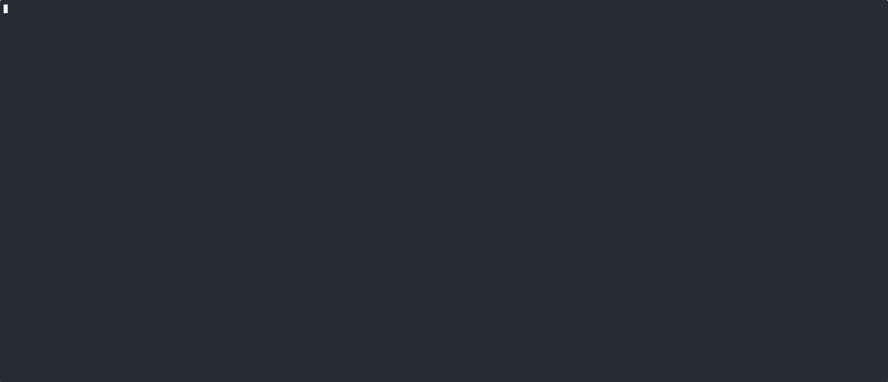

# nukunai
nushell polars scripts to analyse kunai logs.



## requirements 
Nushell and its polars plugins

## transform kunai jsonl files log file to parquet file 
```
nu kunai_to_parquet.nu events.log.1408.gz
╭────┬──────────────────────────────────────────────────────────────────────────────────────────────╮
│ 39 │ unzipped file  from events.log.1408.gz to events.log.1408                                    │
│    │ converting  events.log.1408 to events.log.1408.parquet --eager infer-schema=200000 flat=flat │
╰────┴──────────────────────────────────────────────────────────────────────────────────────────────
ls |get name|each {nu kunai_to_parquet.nu $in}
```

## explore dataset interactively
```
polars open  events.log.1408.parquet|polars collect|polars into-nu |explore
```

## remember kunai events code:
```
❯ nu kunai_print_events_table.nu
╭────┬───────────────────┬───────────╮
│  # │    events_name    │ events_id │
├────┼───────────────────┼───────────┤
│  0 │ execve            │ 1         │
│  1 │ execve_script     │ 2         │
│  2 │ exit              │ 4         │
│  3 │ exit_group        │ 5         │
│  4 │ clone             │ 6         │
│  5 │ prctl             │ 7         │
│  6 │ kill              │ 8         │
│  7 │ ptrace            │ 9         │
│  8 │ init_module       │ 20        │
│  9 │ bpf_prog_load     │ 21        │
│ 10 │ bpf_socket_filter │ 22        │
│ 11 │ mprotect_exec     │ 40        │
│ 12 │ mmap_exec         │ 41        │
│ 13 │ connect           │ 60        │
│ 14 │ dns_query         │ 61        │
│ 15 │ send_data         │ 62        │
│ 16 │ read              │ 81        │
│ 17 │ read_config       │ 82        │
│ 18 │ write             │ 83        │
│ 19 │ write_config      │ 84        │
│ 20 │ file_rename       │ 85        │
│ 21 │ file_unlink       │ 86        │
│ 22 │ write_close       │ 87        │
│ 23 │ file_create       │ 88        │
│ 24 │ io_uring_sqe      │ 100       │
│ 25 │ file_scan         │ 500       │
├────┼───────────────────┼───────────┤
│  # │    events_name    │ events_id │
╰────┴───────────────────┴───────────╯
```

## filter kunai events 

### explore
```
nu filter_events.nu kunai.jsonl.parquet ./events.log.1521.gz -e 1,2,61
main_file_extension = gz
parquet_file_main events.log.1521.parquet
kunai_events_log_file file_extension parquet_file infer_schema events_id: ./events.log.1521.gz gz events.log.1521.parquet 200000 1,2,61
unzipped file  from ./events.log.1521.gz to ./events.log.1521
converting  ./events.log.1521 to ./events.log.1521.parquet --eager infer-schema=200000 flat=flat
parquet_file: events.log.1521.parquet
filter event_id: 1,2,61
```

### -s save filters events to parquet file 
```
nu filter_events.nu kunai.jsonl.parquet ./events.log.1521.gz -e 1,2,61 -s
main_file_extension = parquet
parquet_file_main ./events.log.1384.parquet
kunai_events_log_file unzipped_file file_extension parquet_file infer_schema events_id: ./events.log.1384.parquet ./events.log.1384 parquet ./events.log.1384.parquet 200000 1,2,61
save filtered_events in: ./events.log.1384_1_2_61.parquet
parquet_file: ./events.log.1384.parquet
parquet_file: ./events.log.1384.parquet
filter event_id: 1,2,61
```

## display events count from file

```
nu kunai_events_analysis.nu ./events.log.1503.gz
unzipped file  from ./events.log.1503.gz to ./events.log.1503
converting  ./events.log.1503 to ./events.log.1503.parquet --eager infer-schema=200000 flat=flat
╭────┬───────────────┬────────╮
│  # │     name      │ count  │
├────┼───────────────┼────────┤
│  0 │ prctl         │ 102434 │
│  1 │ send_data     │  90791 │
│  2 │ mmap_exec     │  79647 │
│  3 │ clone         │  61173 │
│  4 │ exit_group    │  52130 │
│  5 │ kill          │  50042 │
│  6 │ execve        │  15732 │
│  7 │ read_config   │  13552 │
│  8 │ connect       │   4479 │
│  9 │ dns_query     │   3118 │
│ 10 │ file_unlink   │   3041 │
│ 11 │ file_create   │   2422 │
│ 12 │ file_rename   │    791 │
│ 13 │ exit          │    316 │
│ 14 │ bpf_prog_load │    117 │
│ 15 │ execve_script │     80 │
╰────┴───────────────┴────────╯
```


## usefull oneliners

```
polars open events.log.5319.parquet | polars shape
╭───┬────────┬─────────╮
│ # │  rows  │ columns │
├───┼────────┼─────────┤
│ 0 │ 412240 │      44 │
╰───┴────────┴─────────╯
```

```
 polars open kunai.jsonl.parquet    | polars schema
╭──────────────┬─────────────────────────────────╮
│ ancestors    │ str                             │
│ command_line │ str                             │
│              │ ╭────────┬─────╮                │
│ exe          │ │ file   │ str │                │
│              │ │ md5    │ str │                │
│              │ │ sha1   │ str │                │
│              │ │ sha256 │ str │                │
│              │ │ sha512 │ str │                │
│              │ │ size   │ i64 │                │
│              │ │ error  │ str │                │
│              │ ╰────────┴─────╯                │
│              │ ╭──────────┬──────╮             │
│ dst          │ │ hostname │ str  │             │
│              │ │ ip       │ str  │             │
│              │ │ port     │ i64  │             │
│              │ │ public   │ bool │             │
│              │ │ is_v6    │ bool │             │
│              │ ╰──────────┴──────╯             
```

### flatten host_container 
```
❯ polars open events.log.1411.parquet
   | polars rename [name] [main_name]
   | polars unnest host
   | polars rename [uuid name container] [host_uuid host_name host_container]
   | polars collect

```
### right way to select containers events
```
timeit {polars open events.log.1380.parquet 
        | polars rename [name] [main_name]
        | polars unnest host
        | polars rename [uuid name container] [host_uuid host_name host_container]
        | polars unnest host_container| polars rename [name type] [container_name container_type]
        | polars filter ((polars col container_type) == "docker")| polars collect|polars into-nu}
16sec 154ms 189µs 325ns
```
### select src dst address dst port
```
 polars open events.log.1375.parquet
     | polars select src dst
     | polars unnest src
     | polars rename [ip port ] [src_ip src_port] 
     | polars unnest dst
     | polars rename [hostname ip port public is_v6]  [dst_hostname dst_ip dst_port dst_public dst_is_v6]
     | polars group-by (polars col dst_ip)
     | polars agg [(polars col dst_port|polars unique)]
     | polars into-nu
╭────┬─────────────────────────────────────────┬────────────────╮
│  # │                 dst_ip                  │    dst_port    │
├────┼─────────────────────────────────────────┼────────────────┤
│  0 │ 2a05:d018:19bb:ea02:8107:67e6:6dd9:97da │ ╭───┬────╮     │
│    │                                         │ │ 0 │ 53 │     │
│    │                                         │ ╰───┴────╯     │
│  1 │ 10.255.255.135                          │ ╭───┬─────╮    │
│    │                                         │ │ 0 │ 443 │    │
│    │                                         │ ╰───┴─────╯    │
│  2 │ 52.212.210.86                           │ ╭───┬─────╮    │
│    │                                         │ │ 0 │  53 │    │
│    │                                         │ │ 1 │ 443 │    │
│    │                                         │ ╰───┴─────╯    │
│  3 │ 54.220.9.34                             │ ╭───┬────╮     │
│    │                                         │ │ 0 │ 53 │     │
│    │                                         │ ╰───┴────╯
```

### dns

```
polars open events.log.1373.parquet 
    | polars  select query response dns_server_ip 
    | polars drop-nulls 
    | polars collect
    | polars into-nu

polars open events.log.1373.parquet
    | polars  select query response dns_server_ip
    | polars drop-nulls
    | polars group-by query|polars agg [(polars col response|polars count) (polars col dns_server_ip|polars unique)]  |polars collect
╭───┬────────────────────────┬──────────┬──────────────────────╮
│ # │         query          │ response │    dns_server_ip     │
├───┼────────────────────────┼──────────┼──────────────────────┤
│ 0 │ api.crowdsec.net       │        4 │ ╭───┬──────────────╮ │
│   │                        │          │ │ 0 │ 10.6.255.106 │ │
│   │                        │          │ ╰───┴──────────────╯ │
│ 1 │ registry.iutbeziers.fr │     2086 │ ╭───┬──────────────╮ │
│   │                        │          │ │ 0 │ 127.0.0.11   │ │
│   │                        │          │ │ 1 │ 10.6.255.106 │ │
│   │                        │          │ ╰───┴──────────────╯ │
│ 2 │ gitlab.com             │        2 │ ╭───┬──────────────╮ │
│   │                        │          │ │ 0 │ 10.6.255.106 │ │
│   │                        │          │ ╰───┴──────────────╯ │

polars open kunai.jsonl_61.parquet   | polars  select query response dns_server |polars drop-duplicates
    | polars group-by query|polars agg [(polars col response|polars count) (polars col dns_server|polars unique)]  |polars collect
╭───┬───────────────┬──────────┬──────────────────────────────────────────╮
│ # │     query     │ response │                dns_server                │
├───┼───────────────┼──────────┼──────────────────────────────────────────┤
│ 0 │ api.ipify.org │        2 │ ╭───┬──────────┬──────┬────────┬───────╮ │
│   │               │          │ │ # │    ip    │ port │ public │ is_v6 │ │
│   │               │          │ ├───┼──────────┼──────┼────────┼───────┤ │
│   │               │          │ │ 0 │ 10.0.2.3 │   53 │ false  │ false │ │
│   │               │          │ ╰───┴──────────┴──────┴────────┴───────╯ │
│ 1 │ kunai-sandbox │        1 │ ╭───┬──────────┬──────┬────────┬───────╮ │
│   │               │          │ │ # │    ip    │ port │ public │ is_v6 │ │
│   │               │          │ ├───┼──────────┼──────┼────────┼───────┤ │
│   │               │          │ │ 0 │ 10.0.2.3 │   53 │ false  │ false │ │
│   │               │          │ ╰───┴──────────┴──────┴────────┴───────╯ │
╰───┴───────────────┴──────────┴──────────────────────────────────────────╯
```

## filter command lines

```
polars open events.log.5319.parquet 
    | polars filter (polars col command_line|polars contains "curl|wget")
    | polars get command_line
    | polars collect
╭───────┬────────────────────────────────────────────────────────────────────────────────────────────────────────────────────────────────────────────╮
│     # │                                                                command_line                                                                │
├───────┼────────────────────────────────────────────────────────────────────────────────────────────────────────────────────────────────────────────┤
│     0 │ curl --max-time 30 --no-buffer -s --unix-socket /var/run/docker.sock http://localhost/containers/json?filters=\{"health":\["unhealthy"\]\} │
│     1 │ curl --max-time 30 --no-buffer -s --unix-socket /var/run/docker.sock http://localhost/containers/json?filters=\{"health":\["unhealthy"\]\} │
│     2 │ curl --max-time 30 --no-buffer -s --unix-socket /var/run/docker.sock http://localhost/containers/json?filters=\{"health":\["unhealthy"\]\} │
│     3 │ curl --max-time 30 --no-buffer -s --unix-socket /var/run/docker.sock http://localhost/containers/json?filters=\{"health":\["unhealthy"\]\} │
│     4 │ curl --max-time 30 --no-buffer -s --unix-socket /var/run/docker.sock http://localhost/containers/json?filters=\{"health":\["unhealthy"\]\} │
│     5 │ curl --max-time 30 --no-buffer -s --unix-socket /var/run/docker.sock http://localhost/containers/json?filters=\{"health":\["unhealthy"\]\} │
│     6 │ curl --max-time 30 --no-buffer -s --unix-socket /var/run/docker.sock http://localhost/containers/json?filters=\{"health":\["unhealthy"\]\} │
│     7 │ curl --max-time 30 --no-buffer -s --unix-socket /var/run/docker.sock http://localhost/containers/json?filters=\{"health":\["unhealthy"\]\} │
│     8 │ curl --max-time 30 --no-buffer -s --unix-socket /var/run/docker.sock http://localhost/containers/json?filters=\{"health":\["unhealthy"\]\} │
│     9 │ curl --max-time 30 --no-buffer -s --unix-socket /var/run/docker.sock http://localhost/containers/json?filters=\{"health":\["unhealthy"\]\} │
│   ... │ ...                                                                                                                                        │
│ 23716 │ curl --max-time 30 --no-buffer -s --unix-socket /var/run/docker.sock http://localhost/containers/json?filters=\{"health":\["unhealthy"\]\} │
│ 23717 │ curl --max-time 30 --no-buffer -s --unix-socket /var/run/docker.sock http://localhost/containers/json?filters=\{"health":\["unhealthy"\]\} │
│ 23718 │ curl --max-time 30 --no-buffer -s --unix-socket /var/run/docker.sock http://localhost/containers/json?filters=\{"health":\["unhealthy"\]\} │
│ 23719 │ curl --max-time 30 --no-buffer -s --unix-socket /var/run/docker.sock http://localhost/containers/json?filters=\{"health":\["unhealthy"\]\} │
│ 23720 │ curl --max-time 30 --no-buffer -s --unix-socket /var/run/docker.sock http://localhost/containers/json?filters=\{"health":\["unhealthy"\]\} │
│ 23721 │ curl --max-time 30 --no-buffer -s --unix-socket /var/run/docker.sock http://localhost/containers/json?filters=\{"health":\["unhealthy"\]\} │
│ 23722 │ curl --max-time 30 --no-buffer -s --unix-socket /var/run/docker.sock http://localhost/containers/json?filters=\{"health":\["unhealthy"\]\} │
│ 23723 │ curl --max-time 30 --no-buffer -s --unix-socket /var/run/docker.sock http://localhost/containers/json?filters=\{"health":\["unhealthy"\]\} │
│ 23724 │ curl --max-time 30 --no-buffer -s --unix-socket /var/run/docker.sock http://localhost/containers/json?filters=\{"health":\["unhealthy"\]\} │
│ 23725 │ curl --max-time 30 --no-buffer -s --unix-socket /var/run/docker.sock http://localhost/containers/json?filters=\{"health":\["unhealthy"\]\} │
╰───────┴────────────────────────────────────────────────────────────────────────────────────────────────────────────────────────────────────────────╯
```

## filter zombie processes
```
polars open  events.log.1502.parquet 
     | polars rename [command_line task flags path exe name] [main_command_line main_task main_flags main_path main_exe main_name] 
     | polars unnest main_task
     | polars rename [name pid tgid guuid uid  gid  namespaces flags] [t_name t_pid t_tgid t_guuid t_uid  t_gid  t_namespaces t_flags] 
     | polars filter ((polars col zombie) == 'true')
     | polars into-nu 
     | flatten --all
     | explore
```


